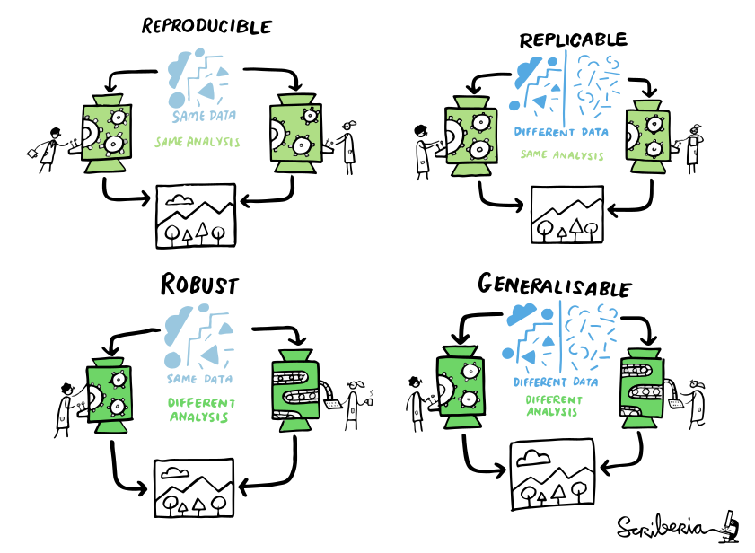

# Computing environment reproducibility 

## Terminology

The Turing Way project illustration. Used under a CC-BY 4.0 licence. DOI: 10.5281/zenodo.3332807.

## Steps towards reproducible research

### It all starts with a good directory structure...

... And version control

### Tracking dependencies

Conda, Anaconda, pip, virtualenv, Pipenv, pyenv, Poetry, requirements.txt, environment.yml, renv, ...

### Recording environments

https://www.reddit.com/r/ProgrammerHumor/comments/cw58z7/it_works_on_my_machine/

### HPC module reprodcuibility

* Container recipes or images
* version numbers software - module
* environment/requirements files with version numbers

### Sharing code and data

The Turing Way project illustration. Used under a CC-BY 4.0 licence. DOI: 10.5281/zenodo.3332807.

[Registry of Research data repositories](https://www.re3data.org)

### Recording computational steps

Workflow tools

### References and Resources

[CodeRefinery reproducible research lesson](https://coderefinery.github.io/reproducible-research/)
[The Turing way - Guide for reproducible research](https://coderefinery.github.io/reproducible-research/)

